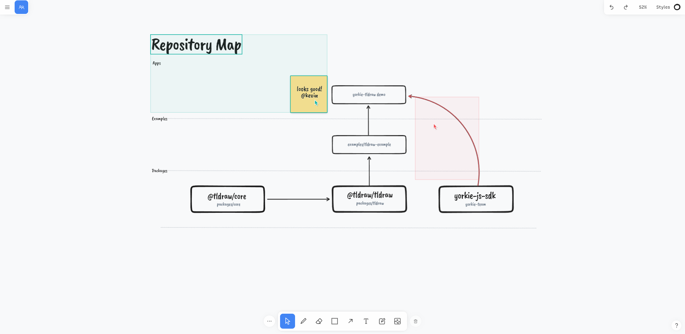

# yorkie-tldraw

A real-time collaboration whiteboard demo project for [yorkie-js-sdk](https://github.com/yorkie-team/yorkie-js-sdk) using [tldraw](https://github.com/tldraw/tldraw)

Demo link: [https://demo.asyncrum.com/](https://demo.asyncrum.com/)

Building real-time collaboration whiteboard using yorkie & tldraw (demo) Youtube link (KOR): https://youtu.be/2FH63ldefPw



## Table of Contents

- Getting Started
  - Prerequisites
  - Instructions
- Development
  - Project Requirements
  - Project Structure
  - About Yorkie
  - Deployment
- Roadmap
- Uploads

## Getting Started

If you are new to yorkie or tldraw and you just want to play around, just clone this repository and follow instructions bellow.

### Prerequisites

- `yarn` or `npm` for client package manager
- `Docker`, `Docker Compose` for server application manager

### Instructions

```bash
# clone repository
git clone https://github.com/Krapi0314/yorkie-tldraw.git

# change to project directory
cd yorkie-tldraw

# change to docker directory
cd docker

# start local server with docker compose
docker-compose up --build -d

# go back to project root directory
cd ..

# install client modules
yarn

# start project and play around!
yarn start
```

## Development

### Project Components

- `React.js` for project base framework
  - For more information, follow: [https://create-react-app.dev/docs/getting-started/](https://create-react-app.dev/docs/getting-started/)
- `@tldraw/tldraw` for React based canvas/svg whiteboard
  - For more information, follow: [https://github.com/tldraw/tldraw](https://github.com/tldraw/tldraw)
- `yorkie-js-sdk` for real-time collaboration sdk for web clients
  - For more information, follow: [https://github.com/yorkie-team/yorkie-js-sdk](https://github.com/yorkie-team/yorkie-js-sdk)
- `yorkie server` for server between yorkie clients
  - For more information, follow: [https://yorkie.dev/docs/server-for-web](https://yorkie.dev/docs/server-for-web)

### Project Structure

**Client**

- `src`
  - `multiplayer`
    - `useMultiplayerState.ts` (mutliplayer state using yorkie and tldraw event callbacks)
  - `App.tsx` (React project entry point which contains tldraw editor component customed by useMultiplayerState.ts)

**Server**

- `docker-compose`
  - `envoy`(gRPC web Proxy), `yorkie server`(with gRPC Server), `mongoDB/in-memory DB` (database)

### About Yorkie

Yorkie is an open source document store for building collaborative editing applications. Yorkie uses JSON-like documents(CRDT) with optional types.

Yorkie references

- Yorkie Github: [https://github.com/yorkie-team/yorkie](https://github.com/yorkie-team/yorkie)
- Yorkie Docs: [https://yorkie.dev/](https://yorkie.dev/)

### Deployment

[https://demo.asyncrum.com/](https://demo.asyncrum.com/) deployment structure are shown below

```
[client]
 ㄴ demo.asyncrum.com   - [Github, gh-pages]  # for serving static pages
[server]
 ㄴ api.yorkie.dev      - [EKS]               # for serving API
```

## Roadmap

### **Phase 1**

- [x] tldraw + yorkie Step 1: yorkie doc update TDType
- [x] tldraw + yorkie Step 2: yorkie presence with peer awareness
- [x] yorkie server stablization: yorkie clustering server on AWS using LB, ec2s, and etcd
- [x] client optimization: loading bar, throttle on overheaded callbacks
- [x] client customization: customize tldraw core: cursor with name

### **Phase 2**

- [x] enable asset (image/video) feature
  - [x] setting storage bucket for media files (ex: AWS S3)
    - [x] setting up presigned url with lambda (optional)
- [ ] undoManager with Yorkie history API (not implemented)

### **Phase 3**

- [ ] implement creative interaction features in tldraw
  - [ ] collaborative reaction
  - [ ] …

## Updates

### **v0.4.1**

- Yorkie SaaS: Yorkie SaaS as API server
- UX: Cursor-with-name resized

### **v0.4**

- Room: Room selection added
- Security: HTTPS enforced
- **Asset: Assets(image/video) feature enabled**

### **v0.3**

- **Peer awareness enhanced: Cursor with name implemented**

### **v0.2**

- Server: Yorkie server cluster mode on AWS
- UX: Client loading bar on Yorkie setup
- **UX: Throttle on `onChangePage()` callback**

### **v0.1**

- tldraw + yorkie Step 1: yorkie doc update TDType
- tldraw + yorkie Step 2: yorkie presence with peer awareness
